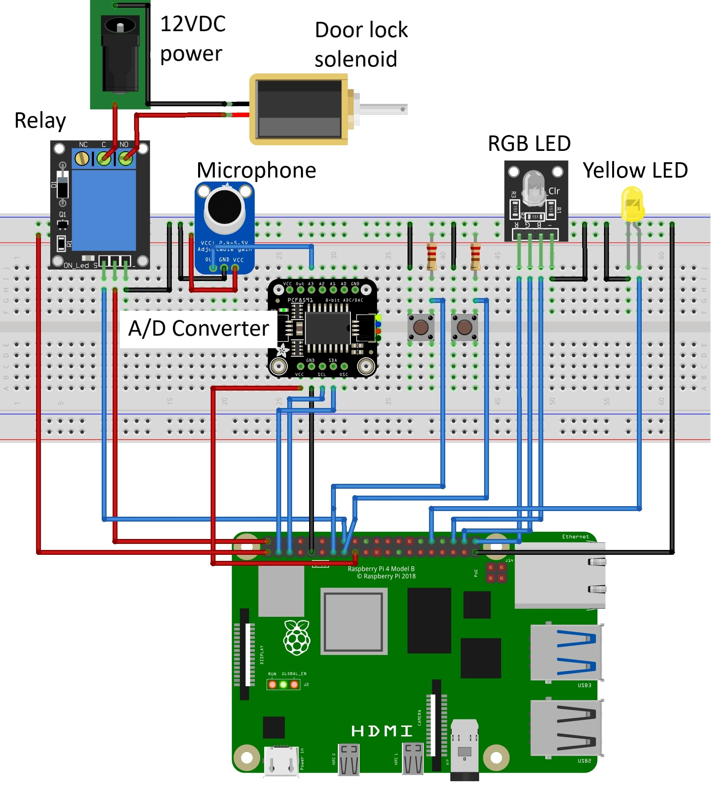
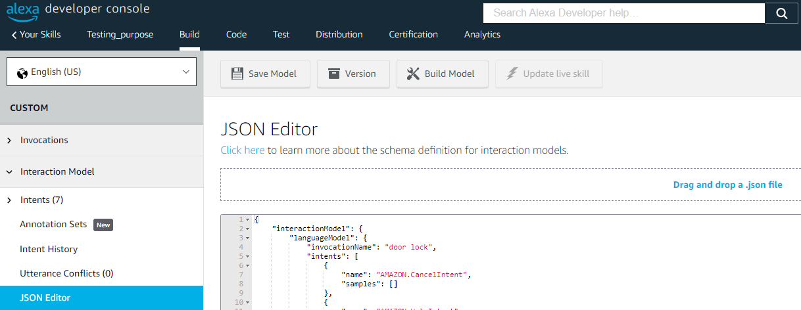
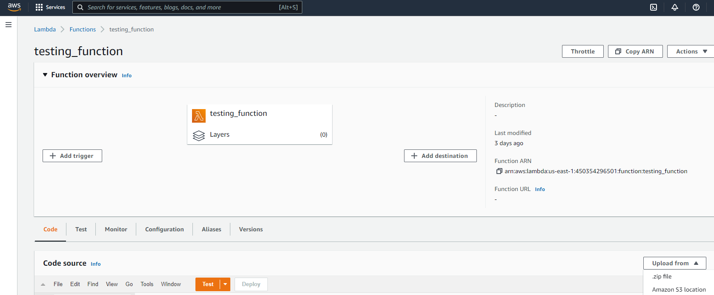
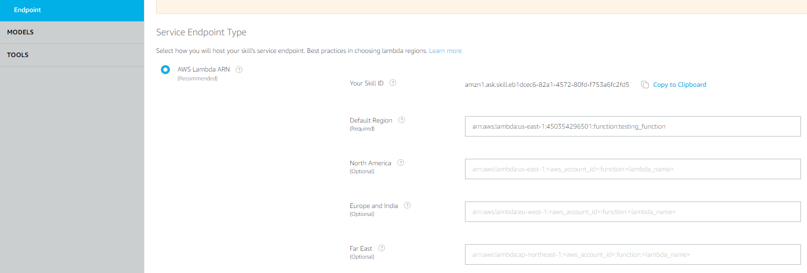
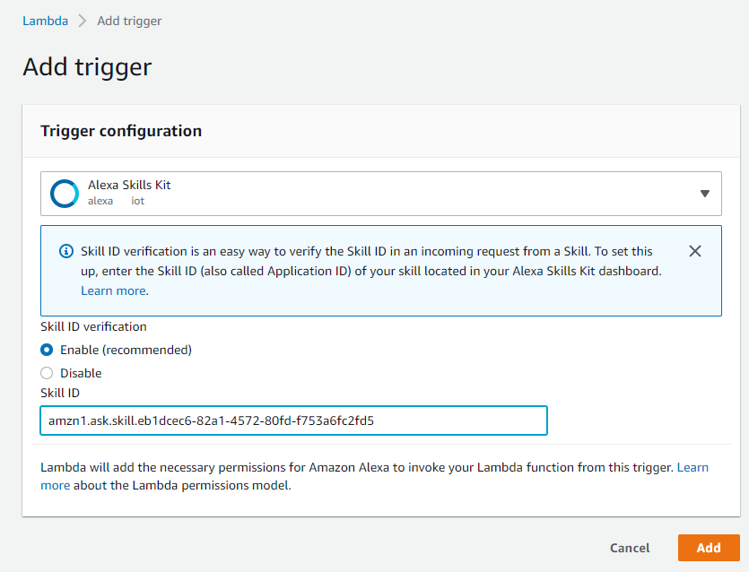

## SMART KNOCK DOOR LOCK WITH AMAZON ALEXA ON RASPBERRY PI

This is the installation guide of the knock pattern detection operated door lock, which can also be controlled using Amazon Alexa device.

### Hardware
The implementation requires the following hardware:
- Raspberry Pi;
- Micro SD card;
- Adafruit PCF8591 analogue to digital converter (ADC);
- Adafruit MAX4466 electret microphone;
- 12V door lock solenoid;
- 5V elay module;
- Yellow and RGB Light-emitting diodes (LEDs);
- Push buttons;
- 2 x 10k ohm resistors.

It is recommended to connect the parts using a prototyping board. The parts must be connected as per diagram below:

### Software
The software installation includes creating an Amazon account to set up a Custom Alexa Skill, AWS Lambda function, AWS IoT Thing and AWS IAM role. The same region accross different AWS services and the same account for the Alexa enabled device must be used.

The contents of the product folders are:
- `raspberry_pi` folder contains the source code run on the Raspberry Pi;
- `lambda` folder contains the source code run in the AWS Lambda function;
- `alexa_skill` folder contsians the custom skill model of the Alexa Skills Kit console.

* Firstly, the a new custom skill must be created under **[Alexa Skills Kit](https://developer.amazon.com/alexa/console/ask)**. Once the skill is created, the `alexa_skill/skill.json` file has to be uploaded under **Build -> Intents -> JSON Editor** tab that looks similar to the image below. Once uploaded, the new model must be **saved** and **built**.

* After uploading the custom skill, a new **[AWS Lambda](https://console.aws.amazon.com/lambda/home)** function has to be created under the **[AWS Console](https://console.aws.amazon.com/console/home)**. The contents of the `lambda` directory must be uploaded as a ZIP file to the Lambda function. The **Function ARN** can be retrieved from the **Function overview** tab as pictured in the image below.

* The retrieved **Function ARN** must be set as the **Endpoint** of the custom Alexa skill. In the **[Alexa Skills Kit Console](https://developer.amazon.com/alexa/console/ask)**, under **Build -> Endpoint** tab only the Default Region must be set to the Lambda function ARN, optional fields should be left empty. The Skill ID must also be retrieved from this tab for the next step.

* Before saving the endpoint, the Alexa Skills Kit Skill ID must be added as a Lambda trigger.

* Once the endpoint is saved, the **[AWS IoT Thing](https://console.aws.amazon.com/iot/home)** instance must be created under the **AWS IoT Core -> Manage -> Things** tab. It must be created as a **Single Thing**, **knock_door_lock** name and an **Unnamed shadow**. The **Auto-generate a new certificate** must be selected. The next step requires to select a policy, which has to be created first selecting the **Create Policy** button. The policy should **allow** **all AWS IoT actions** **and** **resources** by setting the values as the asterisk symbol [\*]. Once the policy is created, in can be selected to proceed creating an AWS IoT Thing. The next step allows to download the certificates of the IoT Thing created, thus the **Device**, **Amazon Root CA 1 certificates** and **private and public key files** must be downloaded.

* To allow Lambda function communicate with the IoT Thing, a new role must be created in the [Identity and Access Management](https://console.aws.amazon.com/iamv2/home) console under **Access management -> Roles** tab. The **AWS service** must be selected as the **trusted entity type**, and **Lambda** as the **use case**. The **AWSLambdaBasicExecutionRole** and **AWSIoTDataAccess** **Permission policies** must be selected. The role must be given an appropriate name.

* **Device Shadow URL** of the IoT Thing must be optained from the **[AWS IoT Core](https://console.aws.amazon.com/iot/home)** **-> Things -> select the IoT Thing -> Device Shadows -> Classic Shadow** tab. Only the subdomain is required to be copied.

* The contents of the `raspberry_pi` directory of this repository must be downloaded to the Raspberry Pi. The previously downloaded Device, Amazon Root CA 1 certificates and the private key must be saved to the **raspberry_pi/certs** directory of the project. The `raspberry_pi/.env_example` file must be renamed to `.env`. Inside the `.env` file the **Device Shadow URL** subdomain must be specified as the endpoint and the certificate names adjusted to match the actual file names.

* The application must be launched from the root folder of the project using terminal command `python mqtt_client.py`.
